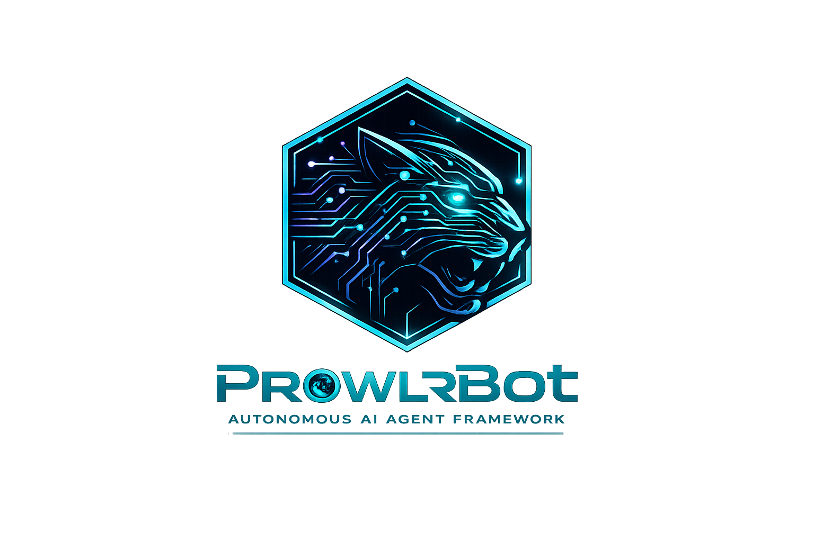

<p align="center">
  
</p>

<h1 align="center">ProwlrBot</h1>
<p align="center"><strong>Always watching. Always ready.</strong></p>

<p align="center">
  <a href="https://github.com/mcpcentral/prowlrbot/actions"></a>
  <a href="https://pypi.org/project/prowlrbot/"></a>
  <a href="https://github.com/mcpcentral/prowlrbot/blob/main/LICENSE"></a>
  <a href="https://github.com/mcpcentral/prowlrbot/stargazers"></a>
  <a href="https://mcpcentral.github.io/prowlr-docs"></a>
</p>

<p align="center">
  Autonomous AI agent platform for monitoring, automation, and multi-channel communication.<br/>
  Deploy intelligent agents that watch your systems, automate workflows, and respond across every channel.
</p>

---

## What is ProwlrBot?

ProwlrBot is an open-source AI agent platform that turns any LLM into an autonomous agent with tools, skills, memory, and multi-channel communication. Think of it as your AI operations center — agents that monitor, respond, and act 24/7.

### Key Features

- **Multi-Provider AI** — OpenAI, Anthropic, Groq, Z.ai, Ollama, and any OpenAI-compatible API. Smart routing picks the best provider automatically.
- **Multi-Channel** — Discord, Telegram, DingTalk, Feishu, QQ, iMessage, and a built-in web console. One agent, every channel.
- **Built-in Tools** — Shell execution, file I/O, browser automation, screenshots, memory search — agents can actually do things.
- **Skills System** — Extensible skill packs for PDF, DOCX, PPTX, XLSX, email, news, cron scheduling, and more.
- **MCP Support** — Full Model Context Protocol client with hot-reload. Connect to any MCP server.
- **Real-time Dashboard** — Live WebSocket-powered command center showing agent activity, tool calls, and system health.
- **Security First** — API token auth, rate limiting, path sandboxing, shell command blocklist, prompt injection detection, secret redaction.
- **Monitoring Engine** — Web change detection, API monitoring, content diffing, and webhook notifications.
- **Cron Jobs** — Schedule agents to run tasks on intervals or cron expressions.
- **Docker Swarm** — Multi-device agent coordination with Redis-backed task queues.
- **Per-Agent Config** — Each agent gets its own personality, tools, skills, model, memory, and autonomy level.

## Quick Start

### Install

```bash
pip install prowlrbot
```

### Initialize

```bash
prowlr init --defaults
```

This creates `~/.prowlrbot/config.json` with default settings. Add your API key:

```bash
prowlr env set OPENAI_API_KEY sk-your-key-here
# or
prowlr env set ANTHROPIC_API_KEY sk-ant-your-key-here
```

### Run

```bash
prowlr app
```

Open [http://localhost:8088](http://localhost:8088) — you'll see the Dashboard with your agent ready to go.

### Chat

```bash
# Web console (built-in)
open http://localhost:8088

# CLI chat
prowlr chat "What's the weather like?"

# Connect a channel
prowlr channels add discord --token YOUR_BOT_TOKEN
prowlr channels add telegram --token YOUR_BOT_TOKEN
```

## Architecture

```
User Message → Channel → ChannelManager → AgentRunner
→ ProwlrBotAgent (ReAct) → Model → Response
→ Channel Output + Memory Persistence
```

### Source Layout

```
src/prowlrbot/
├── agents/           # ReAct agent, tools, skills, memory, prompts
├── app/              # FastAPI app, channels, cron, MCP, routers, WebSocket
├── cli/              # Click CLI (prowlr command)
├── config/           # Pydantic models, hot-reload watcher
├── dashboard/        # Real-time event bus, activity log
├── envs/             # Encrypted environment variable store
├── local_models/     # llama.cpp, MLX, Ollama backends
├── monitor/          # Web/API change detection, diffing, notifications
├── providers/        # Provider registry, health checker, smart router
└── console/          # Built React frontend (served by FastAPI)

console/              # React 18 + Vite + Ant Design frontend source
├── src/pages/        # Dashboard, Chat, Agent Config, Channels, etc.
└── src/api/          # TypeScript API client
```

## Configuration

Main config: `~/.prowlrbot/config.json`

### Providers

ProwlrBot auto-detects available providers from environment variables:

| Provider | Env Var | Models |
|----------|---------|--------|
| OpenAI | `OPENAI_API_KEY` | GPT-4o, GPT-4, GPT-3.5 |
| Anthropic | `ANTHROPIC_API_KEY` | Claude 4.5/4.6, Haiku |
| Groq | `GROQ_API_KEY` | Llama, Mixtral |
| Z.ai | `ZAI_API_KEY` | Various |
| Ollama | (local) | Any pulled model |

### Local Models

Run LLMs entirely on your machine — no API keys or cloud required:

| Backend | Best for | Install |
|---------|----------|---------|
| **llama.cpp** | Cross-platform | `pip install 'prowlrbot[llamacpp]'` |
| **MLX** | Apple Silicon (M1-M4) | `pip install 'prowlrbot[mlx]'` |
| **Ollama** | Cross-platform | `pip install 'prowlrbot[ollama]'` |

### Channels

```bash
prowlr channels add discord --token BOT_TOKEN
prowlr channels add telegram --token BOT_TOKEN
prowlr channels list
```

### Skills

```bash
prowlr skills list          # List available skills
prowlr skills enable pdf    # Enable a skill
prowlr skills disable pdf   # Disable a skill
```

### MCP Servers

Add to `~/.prowlrbot/config.json`:

```json
{
  "mcp": {
    "servers": {
      "filesystem": {
        "command": "npx",
        "args": ["-y", "@modelcontextprotocol/server-filesystem", "/path"]
      }
    }
  }
}
```

## API

ProwlrBot exposes a REST API at `/api`:

| Endpoint | Method | Description |
|----------|--------|-------------|
| `/api/version` | GET | Server version |
| `/api/agents` | GET/POST | List/create agents |
| `/api/agents/{id}` | GET/PUT/DELETE | Agent CRUD |
| `/api/channels` | GET/POST | List/manage channels |
| `/api/skills` | GET | List available skills |
| `/api/cron` | GET/POST | Cron job management |
| `/api/providers` | GET | Available AI providers |
| `/ws/dashboard` | WS | Real-time event stream |

Secure with an API token:

```bash
prowlr env set PROWLRBOT_API_TOKEN your-secret-token
```

## Development

```bash
git clone https://github.com/mcpcentral/prowlrbot.git
cd prowlrbot
pip install -e ".[dev]"
pytest
pre-commit install && pre-commit run --all-files

# Build frontend
cd console && npm ci && npm run build
```

## Ecosystem

| Project | Description |
|---------|-------------|
| [ProwlrBot](https://github.com/mcpcentral/prowlrbot) | Core agent platform |
| [ROAR Protocol](https://github.com/mcpcentral/roar-protocol) | Unified agent communication protocol |
| [Marketplace](https://github.com/mcpcentral/prowlr-marketplace) | Community skill & agent marketplace |
| [Docs](https://mcpcentral.github.io/prowlr-docs) | Documentation & guides |
| [AgentVerse](https://github.com/mcpcentral/agentverse) | Interactive agent virtual world |

## License

[Apache 2.0](LICENSE)

---

<p align="center">
  <strong>ProwlrBot</strong> — Always watching. Always ready.<br/>
  <a href="https://mcpcentral.github.io/prowlr-docs">Docs</a> ·
  <a href="https://github.com/mcpcentral/prowlrbot/issues">Issues</a> ·
  <a href="https://github.com/mcpcentral/prowlr-marketplace">Marketplace</a>
</p>
